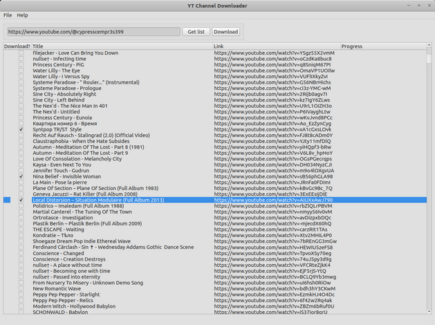

# YT Channel Downloader

 

**YT Channel Downloader** is an intuitive desktop application built to simplify the process of downloading YouTube channel content. Leveraging the robustness of [yt-dlp](https://github.com/yt-dlp/yt-dlp) and [scrapetube](https://github.com/dermasmid/scrapetube) and enriched with a modern PyQt 6 GUI, this tool offers a seamless experience to get your favorite content offline.

---

- [Binaries](#binaries)
- [Features](#features)
- [Installation](#installation)
  - [Linux or MacOS](#linux-or-macos)
  - [Windows](#windows)
- [How to Use](#how-to-use)
- [Contributing](#contributing)
- [License](#license)
- [Authors](#authors)
- [Donation](#donation)

## Binaries

[Download the latest installer for Windows here.](https://quicknode.net/media/dist/ytchandl_015_installer.zip)

Mac and Linux binaries are coming soon.

## Features

- **Fetch Video Listings**: Just input a YouTube channel URL and get a list of all available videos.
- **Selective Download**: Choose exactly which videos you want to download.
- **Quality Control**: Specify video/audio quality or opt to download only the audio.
- **Download Marking**: Keeps track of downloaded files for easier management.

### Coming Soon

- Search field to search within a retrieved list of videos
- Enhanced download progress bar
- Download history tracking
- Support for other audio and video platforms
- General improvements

## Installation

### Linux or MacOS

##### Clone the repository

    git clone <https://github.com/hyperfield/yt-channel-downloader.git>

##### Navigate into the directory

    cd yt-channel-downloader

##### Optional: create a virtual environment

    python3 -m venv .venv

##### Install requirements (optional: in a virtual environment)

    pip install -r requirements.txt

##### Run the program

    python3 main.py

or

    chmod +x main.py

and then

    ./main.py

To deactivate the virtual environment after usage, type

    deactivate

### Windows

#### Using Command Prompt or PowerShell

##### Clone the repository

    git clone https://github.com/my_user_name/yt-channel-downloader.git

##### Navigate into the directory

    cd yt-channel-downloader

##### Optional: Create a virtual environment

    python -m venv .venv

##### Activate the virtual environment

    .venv\Scripts\activate.bat

##### Install requirements

    pip install -r requirements.txt

##### Run the program

    python main.py

##### Deactivate the virtual environment after usage

    .venv\Scripts\deactivate.bat

#### Graphical Interface Approach

1. **Download Git and Python installers** and install them.
2. **Download the repository** as a ZIP file from GitHub and extract it.
3. **Navigate to the directory** and find `requirements.txt`.
4. **Shift + Right-click** in the folder and choose "Open command window here" or "Open PowerShell window here".
5. Follow steps 3-6 from the Command Prompt or PowerShell instructions above.

## How to Use

1. Open the application and input a YouTube channel URL.
2. Go to "File" -> "Settings" and set your download preferences.
3. Press the **Get list** button to list available videos.
4. Select the videos you wish to download.
5. Hit the **Download** button.

## Contributing

Feel free to open issues and pull requests. I appreciate your feedback and contributions.

## License

This project is licensed under the MIT License. See the [LICENSE](LICENSE) file for details.

## Authors

- **hyperfield** - *Initial work* and *Documentation* - [hyperfield](https://github.com/hyperfield)

See also the list of [contributors](https://github.com/hyperfield/yt-channel-downloader/contributors) who participated in this project.

## Donation

If you like this application and feel like you can donate a little bit to support the author and speed up the introduction of new exciting features to the program, I'll appreciate your donation to my PayPal, Bitcoin or Ethereum account. :)

**[PayPal](https://paypal.me/hyperfield)**

**Bitcoin**: bc1pglp2m26kqatgm6z8vtuhk66jd74ghv948wtyhtgtj6wh30nzz6csjajv00

**Ethereum**: 0x9CEf6B928BF9fFd894ca83db1B822820917ca89a
