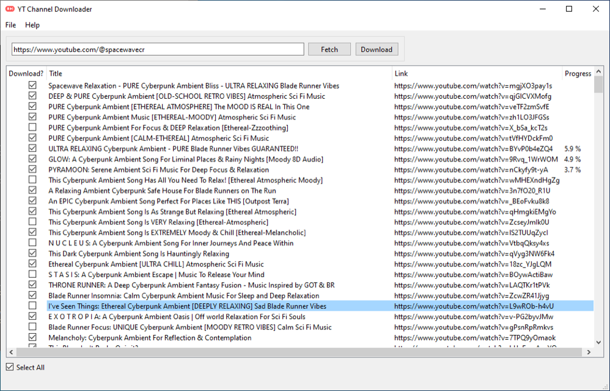
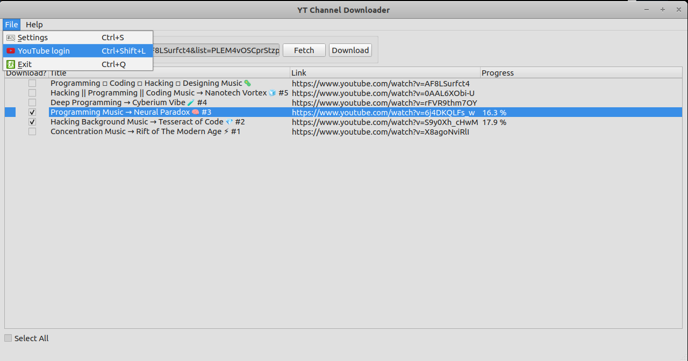
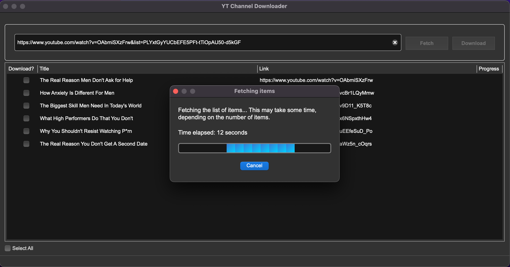

# YT Channel Downloader

[](#) [](https://paypal.me/hyperfield) [](https://liberapay.com/hyperfield/donate)

**YT Channel Downloader** is an intuitive desktop application built to simplify the process of downloading YouTube media content. Leveraging the robustness of [yt-dlp](https://github.com/yt-dlp/yt-dlp), [scrapetube](https://github.com/dermasmid/scrapetube), and [pytube](https://github.com/pytube/pytube), and enriched with a modern PyQt 6 GUI, this tool offers a seamless experience to download your favorite content.





---

- [Change Log](#change-log)
- [Binaries](#binaries)
- [Features](#features)
- [Installation](#installation)
  - [MacOS or Linux](#macos-or-linux)
  - [Windows](#windows)
- [How to Use](#how-to-use)
- [Contributing](#contributing)
- [License](#license)
- [Authors](#authors)
- [Donation](#donation)

## Change Log

### What's New in version 0.4.0

- **YouTube Login and Logout**: You can now log in to your YouTube account directly within the application to download private or age-restricted content. You can log out of your YouTube account with a single click. This action clears the stored cookies and resets the session. The cookies are stored within the app's config directory.
- **Minor Improvements and Bug Fixes**.

### What's New in version 0.3.3

- **Improved default audio track downloading**: the program will now always attempt to download the best available quality audio track. Previously, the associated audio track was not always downloaded, for 4k quality videos in particular.

### What's New in version 0.3.2

- **Fixed the handling of video resolutions and formats specified in Settings**: the program will correctly find the closest available video resolution and format based on user settings, for horizontal and vertical videos.

### What's New in version 0.3.1

- **Limiting of simultaneous download threads**: this improves the responsiveness of the application and optimizes its handling of large download lists.
- **Improved file name sanitation method**: this prevents some completed downloads not being marked as such.

### What's New in version 0.3.0

- **Download playlists**, in addition to channels or single videos
- **Select All** check box: allows to select all non-downloaded videos in a list at once
- **Bug fixes**: improved URL validation, partial download completion
- **Interface improvements**
- **Other improvements**: code cleanup, updated README

## Binaries

[Download the latest installer for Windows here.](https://github.com/hyperfield/yt-channel-downloader/releases)

## Features

- **Fetch Video Listings**: Just input a YouTube video, playlist or channel URL and get a list of the videos.
- **Selective Download**: Choose exactly which videos you want to download, or select all at once.
- **Quality Control**: Specify video/audio quality or opt to download only the associated audio track.
- **Download Marking**: Keeps track of downloaded files for easier management.
- **Playlist Downloads**: Download all or some videos from a playlist URL.
- **Channel Downloads**: Download all or some videos from a channel URL.
- **Single Video or Audio Downloads**: Type in a single video link and download it.
- **Private and Age-Restricted Videos**: Download media on behalf of your Youtube account. 

### Coming Soon

- Download shorts
- Search field to search within a retrieved list of videos
- Enhanced download progress bar
- Download history tracking
- Support for other audio and video platforms
- Functionality improvements
- Interface improvements

## Installation

### MacOS or Linux

`ffmpeg` is needed for the app to work correctly, so make sure you have it on your system. Check in your terminal emulator if `ffmpeg` is installed:

    ffmpeg -version

#### How to install `ffmpeg` on MacOS or Linux

You can download it from [FFmpeg's official site](https://ffmpeg.org/download.html) or install it from a repository according to your OS distribution.

On MacOS with [Homebew](https://brew.sh/):

    brew install ffmpeg

On Debian/Ubuntu:

    sudo apt update
    sudo apt install ffmpeg

On Fedora:

    sudo dnf install ffmpeg

On Arch Linux:

    sudo pacman -S ffmpeg

#### Install YT Channel Downloader

##### Clone the repository

    git clone <https://github.com/hyperfield/yt-channel-downloader.git>

##### Navigate into the directory

    cd yt-channel-downloader

##### Optional: create a virtual environment

    python3 -m venv .venv

##### Install requirements (optional: in a virtual environment)

    pip install -r requirements.txt

##### Run the program

    python3 main.py

or

    chmod +x main.py

and then

    ./main.py

To deactivate the virtual environment after usage, type

    deactivate

### Windows

`ffmpeg` is needed for the app to work correctly, so make sure you have it on your system. Open the command line (`CMD`) and type

    ffmpeg -version

to check if it's on your system.

#### How to install `ffmpeg` on Windows

1. **Download `ffmpeg`**:
   - Visit the official [FFmpeg download page](https://ffmpeg.org/download.html).
   - Alternatively, you can use this direct link: [Download FFmpeg for Windows](https://www.gyan.dev/ffmpeg/builds/ffmpeg-release-essentials.zip).

2. **Extract the files**:
   - Extract the downloaded archive to a directory, such as `C:\ffmpeg`.

3. **Add `ffmpeg` to your system PATH**:
   - Open the Start menu and search for "Environment Variables".
   - Select "Edit the system environment variables".
   - In the "System Properties" window, click on the "Environment Variables" button.
   - Under "System variables", find the `Path` variable and select it. Then click "Edit".
   - Click "New" and add `C:\ffmpeg\bin` to the list. Click "OK" to close all the windows.

4. **Verify the installation**:
   - Open Command Prompt (`CMD`).
   - Run the following command:

     ```sh
     ffmpeg -version
     ```

   - You should see the version information for `ffmpeg` if it is correctly installed.

#### How to install YT Channel Downloader

First, you need `git`. Download the `git-scm` package for Windows from [git-scm.com](https://git-scm.com/downloads) and install it. Verify the installation in `cmd` or `powershell` with

    git --version

You can also now launch `Git Bash` from Start Menu.

##### Clone the repository

    git clone https://github.com/hyperfield/yt-channel-downloader.git

##### Navigate into the directory

    cd yt-channel-downloader

##### Optional: Create a virtual environment

    python -m venv .venv

##### Activate the virtual environment

    .venv\Scripts\activate.bat

##### Install requirements

    pip install -r requirements.txt

##### Run the program

    python main.py

##### Deactivate the virtual environment after usage

    .venv\Scripts\deactivate.bat

#### Graphical Interface Approach

1. **Download Git and Python installers** and install them.
2. **Download the repository** as a ZIP file from GitHub and extract it.
3. **Navigate to the directory** and find `requirements.txt`.
4. **Shift + Right-click** in the folder and choose "Open command window here" or "Open PowerShell window here".
5. Follow steps 3-6 from the Command Prompt or PowerShell instructions above.

## How to Use

1. Open the application and input a YouTube channel URL.
2. Go to "File" -> "Settings" and set your download preferences.
3. Press the **Get list** button to list available videos.
4. Select the videos you wish to download.
5. Hit the **Download** button.

## Contributing

Feel free to open issues and pull requests. I appreciate your feedback and contributions.

## License

This project is licensed under the MIT License. See the [LICENSE](LICENSE) file for details.

## Authors

- **hyperfield** - *Initial work* and *Documentation* - [hyperfield](https://github.com/hyperfield)

See also the list of [contributors](https://github.com/hyperfield/yt-channel-downloader/contributors) who participated in this project.

## Donation

If you like this application and feel like you can donate a little bit to support the author and speed up the introduction of new exciting features to the program, I'll appreciate your donation to my PayPal, Bitcoin or Ethereum account. :)

**[PayPal](https://paypal.me/hyperfield)**

**Bitcoin**: bc1pglp2m26kqatgm6z8vtuhk66jd74ghv948wtyhtgtj6wh30nzz6csjajv00

**Ethereum**: 0x9CEf6B928BF9fFd894ca83db1B822820917ca89a
