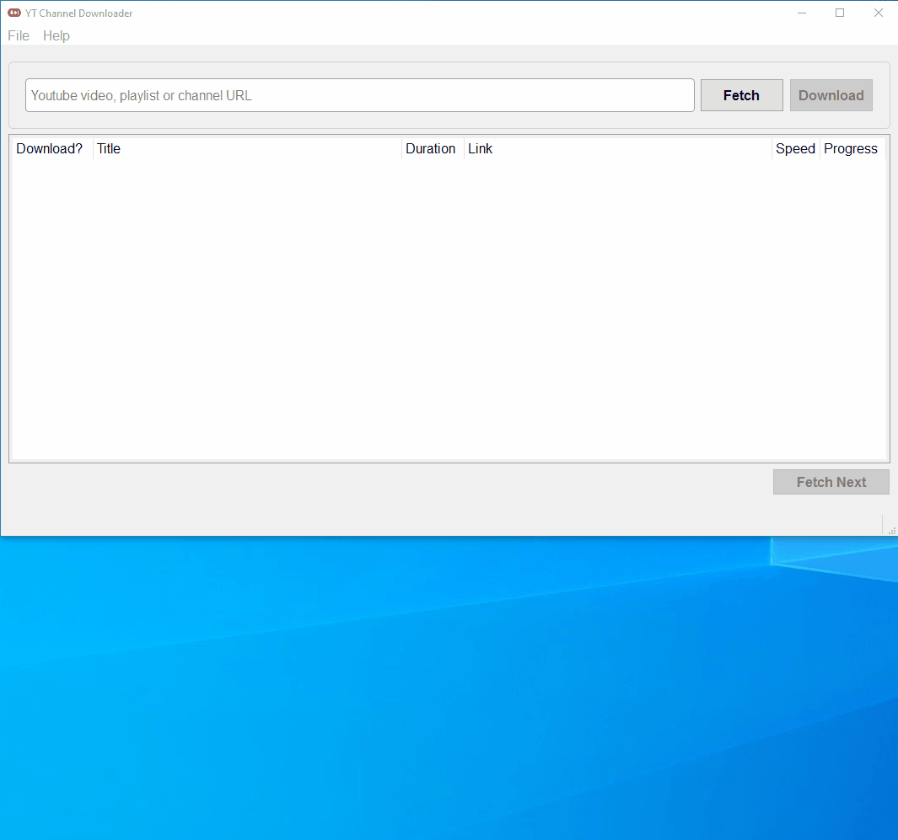
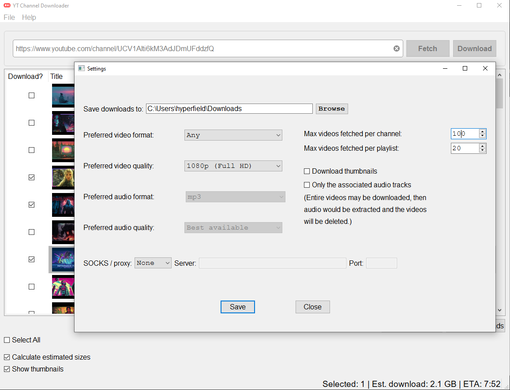
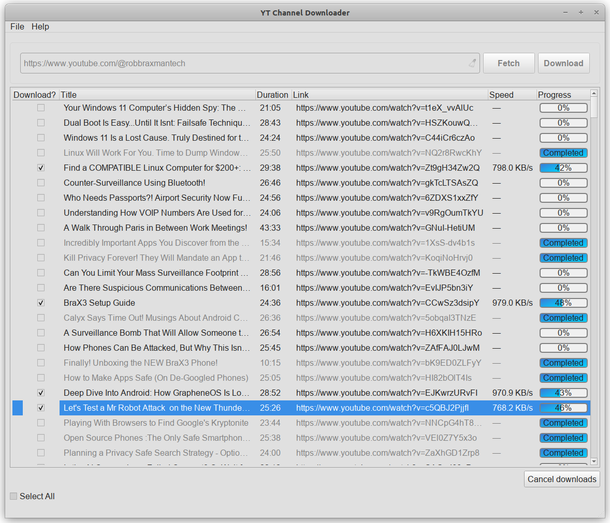
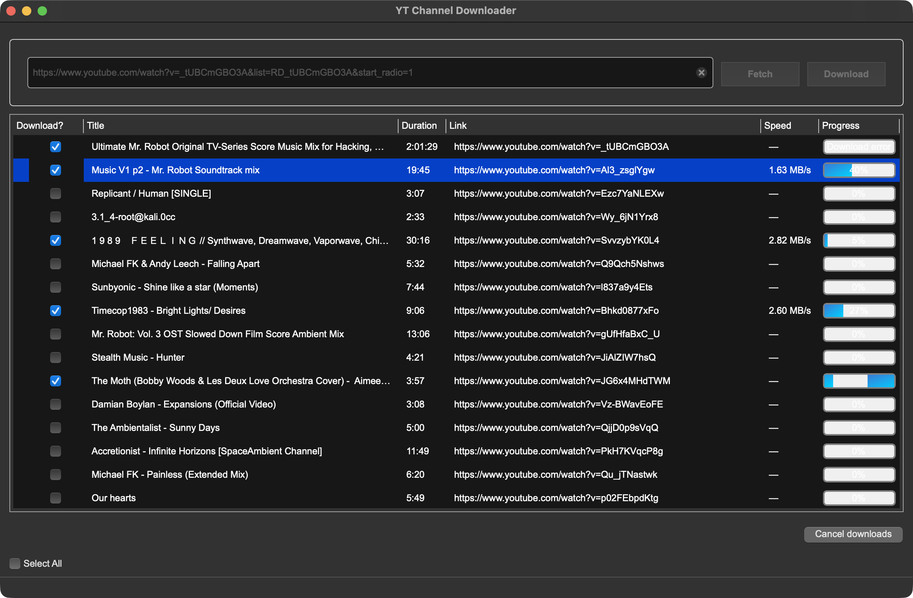

# YT Channel Downloader

[](#) [](https://app.codacy.com/gh/hyperfield/yt-channel-downloader/dashboard?utm_source=gh&utm_medium=referral&utm_content=&utm_campaign=Badge_grade) [](https://ko-fi.com/hyperfield) [](https://sourceforge.net/projects/yt-channel-downloader/files/latest/download) [](https://sourceforge.net/projects/yt-channel-downloader/files/latest/download)

[](https://sourceforge.net/projects/yt-channel-downloader/files/latest/download)

**YT Channel Downloader** is an intuitive desktop application built to simplify the process of downloading YouTube media content. Leveraging the robustness of [yt-dlp](https://github.com/yt-dlp/yt-dlp) and enriched with a modern PyQt 6 GUI, this tool offers a seamless experience to download your favorite content.






---

- [Change Log](#change-log)
- [Binaries](#binaries)
- [Features](#features)
- [Installation](#installation)
  - [Install from PyPI](#install-from-pypi)
  - [MacOS or Linux (from source)](#macos-or-linux-from-source)
  - [Windows](#windows)
- [How to Use](#how-to-use)
- [Contributing](#contributing)
- [License](#license)
- [Authors](#authors)
- [Donation](#donation)

## Change Log

Latest: **0.8.0**

- Estimated download size before downloads start.
- Estimated download time / ETA.
- Missing JavaScript runtime detection with a guidance dialog.
- Pagination for channels and playlists to keep large lists responsive.
- Cancelable size/ETA calculation with improved progress updates.
- Thumbnails shown immediately after fetching data.

[Full changelog](CHANGELOG.md).

## Binaries

[Download the latest binary releases here.](https://github.com/hyperfield/yt-channel-downloader/releases)

## Features

- **Fetch Video Listings**: Just input a YouTube video, playlist or channel URL and get a list of the videos.
- **Selective Download**: Choose exactly which videos you want to download, or select all at once.
- **Quality Control**: Specify video/audio quality or opt to download only the associated audio track.
- **Download Marking**: Keeps track of downloaded files for easier management.
- **Size & Time Estimates**: Preview total download size and ETA before starting, with cancelable calculations.
- **Pagination for Large Lists**: Channels and playlists load in pages to keep the UI responsive.
- **Thumbnail Previews & Downloads**: See thumbnails as soon as items are fetched, and save them with your downloads.
- **Playlist Downloads**: Download all or some videos from a playlist URL.
- **Channel Downloads**: Download all or some videos from a channel URL.
- **Single Video or Audio Downloads**: Paste any supported link (YouTube, Vimeo, Twitch, SoundCloud, Facebook, Instagram, Twitter/X, TikTok, Udemy*, Reddit, and more via yt-dlp) and download it.
- **Runtime Detection**: Get guided prompts if an optional JavaScript runtime for yt-dlp is missing.
- **Private and Age-Restricted Videos**: Download media on behalf of your Youtube account.

\*Some providers (for example, Udemy or other premium services) still require valid account cookies/credentials. Configure them via `File -> YouTube login` (cookies-from-browser) before attempting restricted downloads.

### Coming Soon

- Search field to search within a retrieved list of videos
- Download history tracking
- [Suggest a feature!](https://github.com/hyperfield/yt-channel-downloader/issues)

## Installation

### Install from PyPI

The easiest way to get the desktop app is straight from PyPI. Make sure FFmpeg is installed (see below), then run:

```bash
pip install yt-channel-downloader
```

If you don't have `pip`, you can use `python -m pip` instead.

To update the app to the latest version from PyPI:

```bash
pip install --upgrade yt-channel-downloader
yt-channel-downloader
```

### Install the .deb (Debian/Ubuntu)

1. Download the latest `.deb` from the releases page (or build one with `./scripts/create_binary.sh` then `./scripts/create_deb.sh`).
2. Install it with `apt` so dependencies are resolved:

```bash
sudo apt install ./yt-channel-downloader_<version>_<arch>.deb
```

3. Launch with:

```bash
yt-channel-downloader
```

### MacOS or Linux (from source)

`ffmpeg` is needed for the app to work correctly, so make sure you have it on your system. Check in your terminal emulator if `ffmpeg` is installed:

    ffmpeg -version

#### How to install `ffmpeg` on MacOS or Linux

You can download it from [FFmpeg's official site](https://ffmpeg.org/download.html) or install it from a repository according to your OS distribution.

On MacOS with [Homebew](https://brew.sh/):

    brew install ffmpeg

On Debian/Ubuntu:

    sudo apt update
    sudo apt install ffmpeg

On Fedora:

    sudo dnf install ffmpeg

On Arch Linux:

    sudo pacman -S ffmpeg

#### Recommended: JavaScript runtime (improves YouTube format coverage)

yt-dlp can use a JavaScript runtime to parse YouTube player code; having one installed reduces missing formats and silences runtime warnings. Install any of:

- **Node.js** via your package manager:
  - Debian/Ubuntu: `sudo apt update && sudo apt install nodejs npm`
  - Fedora: `sudo dnf install nodejs npm`
  - Arch Linux: `sudo pacman -S nodejs npm`
  - macOS (Homebrew): `brew install node`
- **Deno** (alternative runtime): see install instructions at [deno.com](https://deno.com/)

#### Install YT Channel Downloader

##### Clone the repository

    git clone https://github.com/hyperfield/yt-channel-downloader.git

##### Navigate into the directory

    cd yt-channel-downloader

##### Create a virtual environment

    python3 -m venv .venv

##### Activate the virtual environment

    .venv/bin/activate

##### Install the project in editable mode

    pip install -e .

##### Run the program

    yt-channel-downloader

To deactivate the virtual environment after usage, type

    deactivate

### Windows

`ffmpeg` is needed for the app to work correctly, so make sure you have it on your system. Open the command line (`CMD`) and type

    ffmpeg -version

to check if it's on your system.

#### How to install `ffmpeg` on Windows

1. **Download `ffmpeg`**:
   - Visit the official [FFmpeg download page](https://ffmpeg.org/download.html).
   - Alternatively, you can use this direct link: [Download FFmpeg for Windows](https://www.gyan.dev/ffmpeg/builds/ffmpeg-release-essentials.zip).

2. **Extract the files**:
   - Extract the downloaded archive to a directory, such as `C:\ffmpeg`.

3. **Add `ffmpeg` to your system PATH**:
   - Open the Start menu and search for "Environment Variables".
   - Select "Edit the system environment variables".
   - In the "System Properties" window, click on the "Environment Variables" button.
   - Under "System variables", find the `Path` variable and select it. Then click "Edit".
   - Click "New" and add `C:\ffmpeg\bin` to the list. Click "OK" to close all the windows.

4. **Verify the installation**:
   - Open Command Prompt (`CMD`).
   - Run the following command:

     ```sh
     ffmpeg -version
     ```

   - You should see the version information for `ffmpeg` if it is correctly installed.

#### Recommended: Node.js runtime (improves YouTube format coverage)

yt-dlp can use a JavaScript runtime to parse YouTube player code; having Node.js installed reduces missing formats and silences runtime warnings.

- Download and install the LTS version from [nodejs.org](https://nodejs.org/)
- Or with Chocolatey: `choco install nodejs-lts`
- Or with Scoop: `scoop install nodejs-lts`
- Alternative runtime: [Deno](https://deno.com/) (install instructions on the homepage)

#### How to install YT Channel Downloader

Install or upgrade the app with pip (PowerShell or Command Prompt):

```powershell
python -m pip install --upgrade yt-channel-downloader
yt-channel-downloader
```

#### Optional: run from a cloned repository

1. Clone the repo and open PowerShell in the project root.
2. Create and activate a virtual environment:

    ```powershell
    python -m venv .venv
    .venv\Scripts\activate
    ```

3. Install the project in editable mode:

    ```powershell
    pip install -e .
    ```

4. Launch the app:

    ```powershell
    yt-channel-downloader
    ```

5. Deactivate the environment when finished with `deactivate`.

## How to Use

1. Open the application and input a YouTube channel, playlist, or video URL.
2. Go to "File" -> "Settings" and set your download preferences.
3. Press the **Get list** button to list available videos.
4. Review thumbnails plus the size/ETA preview; select the videos you wish to download.
5. Hit the **Download** button.

## Contributing

Feel free to open issues and pull requests. I appreciate your feedback and contributions.

## License

This project is licensed under the MIT License. See the [LICENSE](LICENSE) file for details.

## Authors

- **hyperfield** - *Initial work* and *Documentation* - [hyperfield](https://github.com/hyperfield)

See also the list of [contributors](https://github.com/hyperfield/yt-channel-downloader/contributors) who participated in this project.

## Donation

If you like this application and want to support future development, I'll appreciate your donation via Ko-Fi or crypto. :)

[](https://ko-fi.com/hyperfield)  

**Bitcoin**: bc1pglp2m26kqatgm6z8vtuhk66jd74ghv948wtyhtgtj6wh30nzz6csjajv00

**Ethereum**: 0x9CEf6B928BF9fFd894ca83db1B822820917ca89a

**Tron**: TGq2z17jq8UruCNyyD5GU3weuyJSyM2zBp

**Binance Smart Chain**: 0x863F8f3fC38b7540110462884809621e2B9EE399
